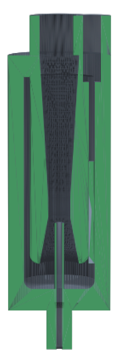
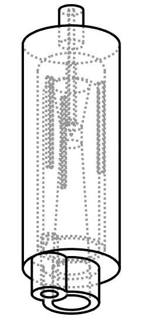
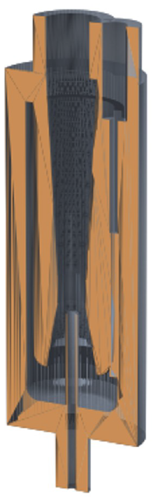
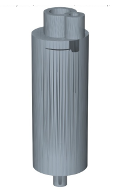
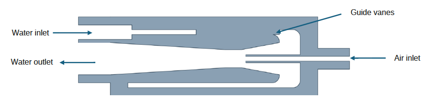

# Coaxial Counterflow Venturi

Parametric CAD model of a miniature water/air Venturi ejector, written as code with [CadQuery](https://github.com/CadQuery/cadquery) (OpenCASCADE kernel). The whole part is generated from about twenty primary parameters and exported to STEP, STL and SVG.

                        

*[Version française plus bas.](#venturi-coaxial-à-contre-courant)*

Longer discussion, with the boundary layer separation and Dean vortex arguments, is in [docs/design-notes.md](docs/design-notes-EN.pdf).

## Principle

The design decouples the two operations that a naive Venturi ejector superimposes at the throat: **turning the flow** and **accelerating it**.

1. Water enters through an off axis port on the front face and fills an external annular plenum.
2. It travels along the periphery and performs its 180 degree turn at the closed end, at low velocity.
3. It then accelerates in a straight internal Venturi, where the streamlines no longer curve.
4. It leaves through the centre of the same front face.
5. Air is admitted from the opposite face through a fixed coaxial needle whose tip opens exactly at the throat, in the zone of maximum depression.

## Design rationale

A singular pressure loss scales with the local dynamic pressure:

$$\Delta P_s = K \cdot \tfrac{1}{2}\rho v^2$$

The loss coefficient $K$ of a 180 degree bend (roughly 1.5 to 2.2) depends on geometry, not on velocity. Performing that turn at the throat rather than upstream therefore multiplies its cost by the square of the velocity ratio, which mass conservation fixes at the inverse area ratio:

$$\frac{\Delta P_{throat}}{\Delta P_{inlet}} = \left(\frac{v_{throat}}{v_{inlet}}\right)^2 = \left(\frac{A_{inlet}}{A_{throat}}\right)^2$$

For an area ratio between 4 and 6, the same geometric turn costs 16 to 36 times more when it is placed at the throat. That dissipation eats the very depression the Venturi is supposed to create.

The geometry that follows from this observation:

| Choice | Reason |
|---|---|
| Annular free area set to 4x the throat area | Velocity in the annulus stays below a quarter of the throat velocity, so the turning loss drops by a factor of 16 |
| Turnaround radius >= 1.5x the annulus width | Keeps the 180 degree bend gentle, both corners are filleted tangentially in the meridian profile |
| Convergent 21 degrees, divergent 7 degrees (included angles) | ISO 5167 values, the shallow divergent keeps the adverse pressure gradient soft enough for the boundary layer to stay attached |
| 3 guide vanes at 120 degrees in the annulus | Break the azimuthal coherence of the Dean vortex cells and keep the return flow axisymmetric |
| Throat bored at 2.236 mm for a 1 mm needle | Compensates the blockage of the needle so the effective water passage stays at 2 mm |

## Current geometry

| Quantity | Value |
|---|---|
| Effective throat diameter | 2.00 mm |
| Physical throat diameter | 2.24 mm |
| Annulus to throat area ratio | 4.0 |
| Convergent / throat / divergent length | 4.76 / 2.00 / 14.42 mm |
| Body length | 25.98 mm |
| Outer diameter | 10.41 mm |
| Air needle | 1.0 mm outer, 0.6 mm bore |

## Status

This is a geometry study. The dimensioning rules come from ISO 5167 and from classical loss coefficient correlations. No CFD run and no flow bench measurement back it up yet, so the numbers above describe the model, not a validated performance.

---

# Venturi coaxial à contre-courant

Modèle CAO paramétrique d'un éjecteur Venturi eau/air miniature, écrit sous forme de code avec [CadQuery](https://github.com/CadQuery/cadquery) (noyau OpenCASCADE). La pièce entière est générée à partir d'une vingtaine de paramètres primaires, puis exportée en STEP, STL et SVG.

                        

Le développement complet, avec les arguments de décollement de couche limite et de vortex de Dean, se trouve dans [docs/design-notes.md](docs/design-notes-FR.pdf) (en français).

## Principe

La conception découple les deux opérations qu'un éjecteur Venturi superpose au col : **le retournement du fluide** et **son accélération**.

1. L'eau entre par un orifice excentré en face avant et remplit un plénum annulaire externe.
2. Elle parcourt la périphérie et effectue son demi tour à 180 degrés au fond, à basse vitesse.
3. Elle accélère ensuite dans un Venturi interne rectiligne, où les lignes de courant ne tournent plus.
4. Elle ressort par le centre de cette même face avant.
5. L'air est admis par la face opposée via une aiguille coaxiale fixe dont la pointe débouche exactement au col, dans la zone de dépression maximale.

## Justification du dimensionnement

Une perte de charge singulière est proportionnelle à la pression dynamique locale :

$$\Delta P_s = K \cdot \tfrac{1}{2}\rho v^2$$

Le coefficient de perte $K$ d'un retournement à 180 degrés (de l'ordre de 1,5 à 2,2) dépend de la géométrie, pas de la vitesse. Faire tourner le fluide au col plutôt qu'en amont multiplie donc le coût de ce virage par le carré du rapport des vitesses, lui même imposé par la conservation du débit :

$$\frac{\Delta P_{col}}{\Delta P_{entree}} = \left(\frac{v_{col}}{v_{entree}}\right)^2 = \left(\frac{A_{entree}}{A_{col}}\right)^2$$

Pour un rapport de sections compris entre 4 et 6, le même virage géométrique coûte 16 à 36 fois plus cher s'il est placé au col. Cette dissipation consomme précisément la dépression que le Venturi est censé créer.

La géométrie qui découle de ce constat :

| Choix | Raison |
|---|---|
| Section annulaire fixée à 4x la section du col | La vitesse dans l'anneau reste sous le quart de la vitesse au col, la perte du retournement est divisée par 16 |
| Rayon de retournement >= 1,5x la largeur d'anneau | Adoucit le demi tour, les deux coins sont raccordés tangentiellement dans le profil méridien |
| Convergent 21 degrés, divergent 7 degrés (angles inclus) | Valeurs ISO 5167, le divergent faible garde un gradient de pression adverse assez doux pour que la couche limite reste attachée |
| 3 ailettes de guidage à 120 degrés dans l'anneau | Brisent la cohérence azimutale des cellules de Dean et maintiennent un retour axisymétrique |
| Col alésé à 2,236 mm pour une aiguille de 1 mm | Compense l'encombrement de l'aiguille pour conserver un passage d'eau effectif de 2 mm |

## Géométrie actuelle

| Grandeur | Valeur |
|---|---|
| Diamètre de col effectif | 2,00 mm |
| Diamètre de col physique | 2,24 mm |
| Rapport section annulaire / col | 4,0 |
| Longueurs convergent / col / divergent | 4,76 / 2,00 / 14,42 mm |
| Longueur du corps | 25,98 mm |
| Diamètre extérieur | 10,41 mm |
| Aiguille d'air | 1,0 mm extérieur, 0,6 mm d'alésage |

## État du projet

Il s'agit d'une étude géométrique. Les règles de dimensionnement viennent de l'ISO 5167 et de corrélations classiques de coefficients de perte. Aucun calcul CFD ni essai sur banc ne les valide pour l'instant : les valeurs ci dessus décrivent le modèle, pas une performance mesurée.
